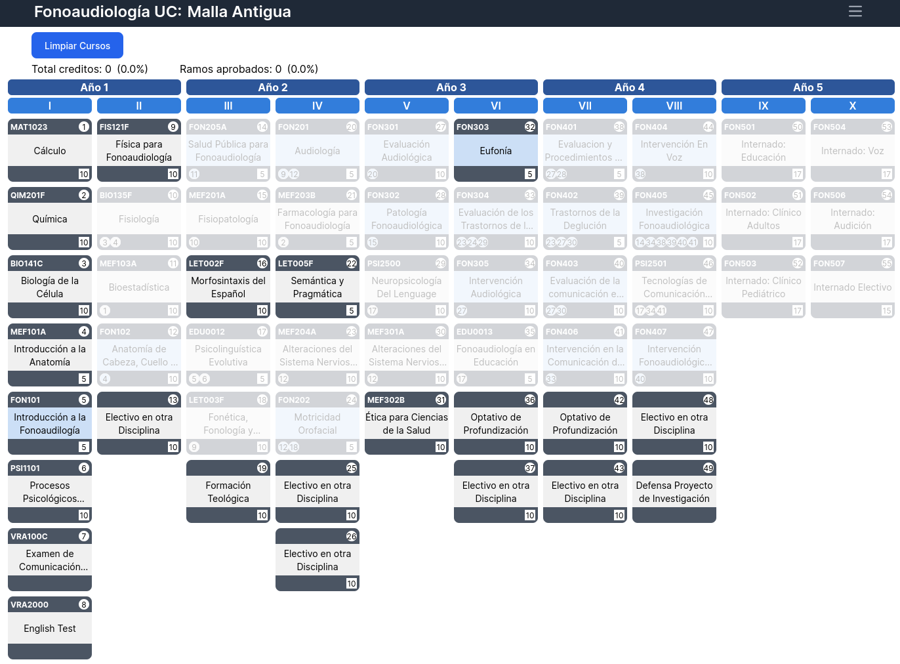

# Interactive University Curriculum

<div align="center">
  <p align="center">
    <a href="https://basy-medy.github.io/Malla_PU/" target="_blank">Demo</a>
    ·
    <!--  
    <a href="#" target="_blank">Video</a>
    · -->
    <a href="https://github.com/basy-medy/Malla_PU/

<details>

<summary>Table of Contents</summary>
  <ol>
    <li>
      <a href="#about-the-project">About The Project</a>
      <ul>
        <li><a href="#built-with">Built With</a></li>
      </ul>
    </li>
    <li>
        <a href="#getting-started">Getting Started</a>
        <ul>
        <li><a href="#prerequisites">Prerequisites</a></li>
        <li><a href="#installation">Installation</a></li>
      </ul>
    </li>
    <li><a href="#acknowledgments">Acknowledgments</a></li>
    <li><a href="#contact">Contact</a>

</ol>
</details>

## About The Project



This is an app that has an interactive university curriculum for the bachelors of Urban Planingn with the adition of the master degree at UC.

### Built With

<div style="display: flex; gap: 4px;">
  <a href='https://vitejs.dev/'>
  
  </a>
  <a href='https://react.dev/'>
  
  </a>
  <a href='https://tailwindcss.com/'>
  
  </a>
</div>

## Getting Started

### Prerequisites

- [Yarn](https://classic.yarnpkg.com/en/)

### Installation

1. Clone the repo

```bash
https://github.com/loretito/malla-interactiva-uc
```

2. Install packages

```bash
yarn
```

3. Run

```bash
yarn dev
```

4. Build for production

```bash
yarn run deploy
```

## Acknowledgments

- [Flowbite](https://flowbite.com/)
- [Google Fonts](https://fonts.google.com/)
- [Malla Interactiva UC](https://github.com/loretito/malla-interactiva-uc)
- [Astro UC Malla](https://github.com/jj-sm/Astro-UC-Malla)

## Contact

Bastián Medina - [@basy_medy](https://t.me/basy_medy) - basty.medy@gmail.com
